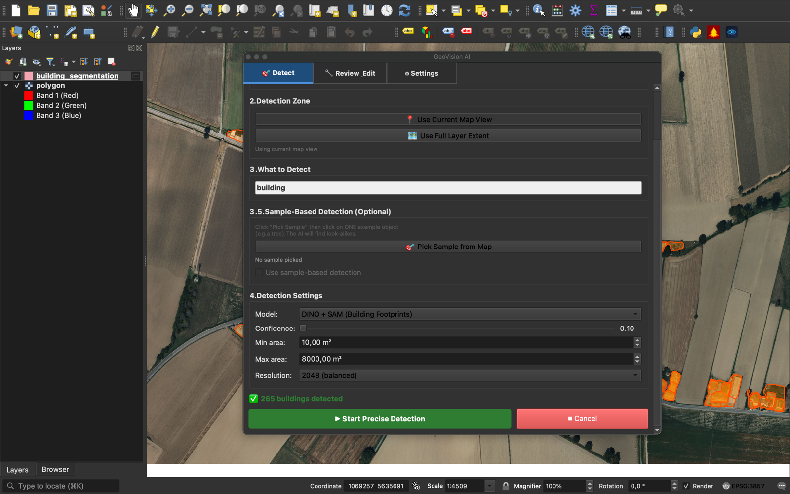
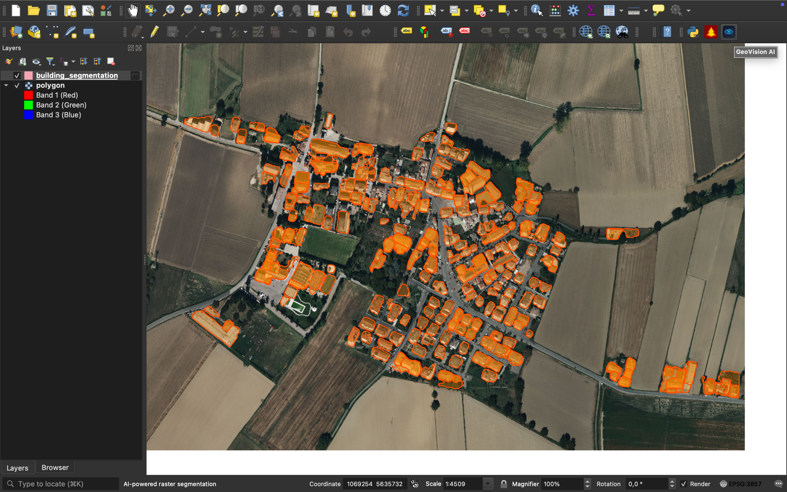
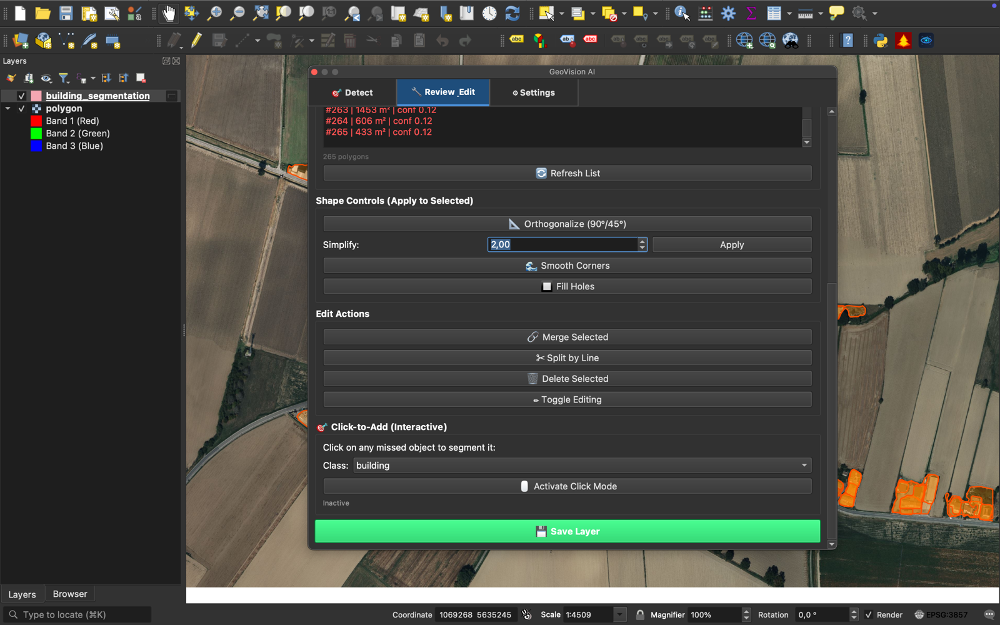
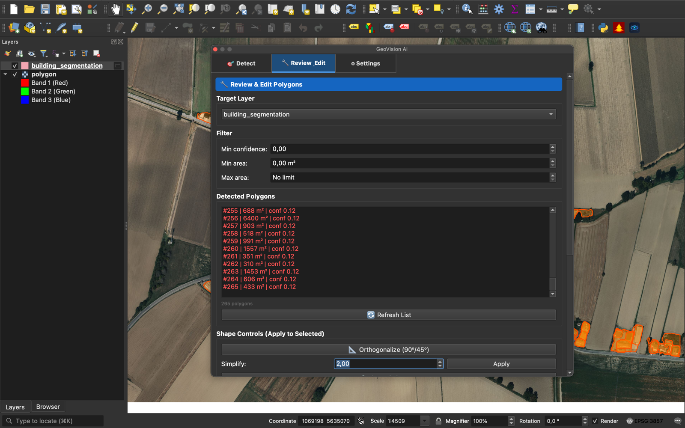
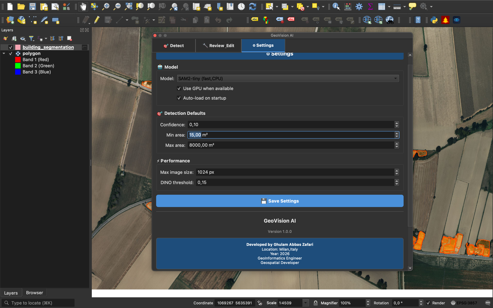
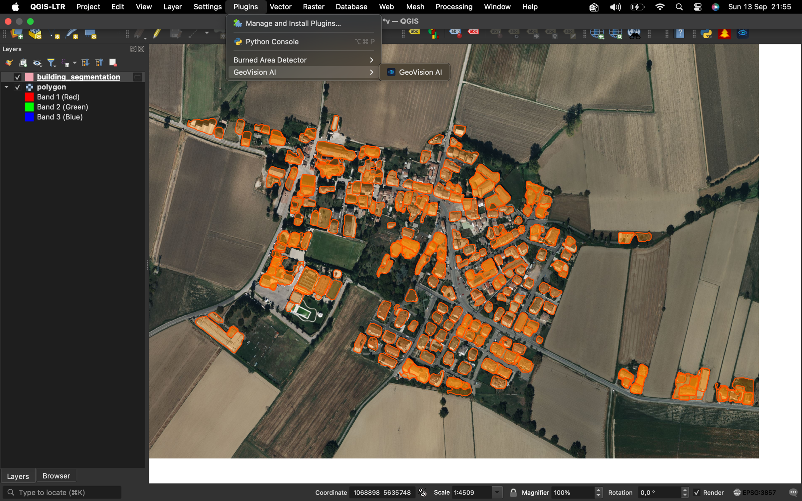
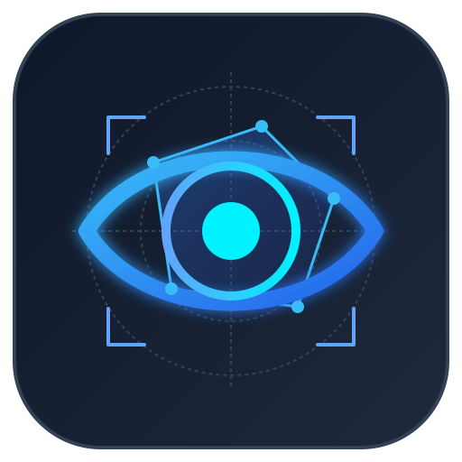

# GeoVision AI

### AI-powered building footprint detection for QGIS

Turn satellite and aerial imagery into clean, editable building polygons — **fully offline**, no cloud, no subscription.

[](https://python.org)
[](https://qgis.org)
[](https://pytorch.org)
[](LICENSE)

</div>

---

## 🎯 What It Does

GeoVision AI takes any raster visible in QGIS — satellite imagery, drone orthomosaics, WMS layers — and extracts **individual building footprints** as vector polygons. No manual digitization, no cloud uploads, no subscriptions.

Every polygon comes with attributes:

| Field | Description |
|-------|-------------|
| `id` | Sequential identifier |
| `class` | Detected class (`building`) |
| `area_m2` | Area in square meters |
| `perimeter_m` | Perimeter in meters |
| `confidence` | Model confidence (0–1) |

---

## 📸 Screenshots

### Detect Tab — Run detection on any raster



### Detected Buildings — 265 building footprints from a single Milan image



### Review & Edit — Filter, edit, merge, split, and clean up detections



### Review Detail — Shape controls and interactive click-to-add



### Settings Tab — Model config, defaults, and credits



### Docked in QGIS — Clean integration with the QGIS interface



---

## ✨ Features

- ✅ **Text-prompted building detection** — powered by Grounding DINO + Meta's Segment Anything (SAM)
- ✅ **Runs 100% locally** — no cloud, no upload, no subscription
- ✅ **Works with any raster** — GeoTIFF, WMS, WMTS, drone orthomosaics, Bing Satellite, etc.
- ✅ **Vector output with full attributes** — id, class, area_m2, perimeter_m, confidence
- ✅ **Tabbed UI** — Detect, Review & Edit, Settings
- ✅ **Interactive refinement** — merge, split, delete, add missed objects with one click
- ✅ **Project CRS preserved** — polygons come back in your project's coordinate system
- ✅ **Cross-platform** — Windows, macOS, Linux

---

## 🚀 Quick Start

### 1. Install dependencies in QGIS Python

```bash
/Applications/QGIS-LTR.app/Contents/MacOS/bin/python3 -m pip install --user \
    torch==2.2.2 torchvision==0.17.2 \
    segment-anything==1.0 \
    opencv-python==4.8.1.78 \
    numpy==1.26.4
```

### 2. Install the plugin

**Option A — From ZIP:**
1. Download `geovision_ai_plugin.zip` from [Releases](https://github.com/zafariabbas68/geovision-ai-qgis-plugin/releases)
2. QGIS → Plugins → Manage and Install Plugins → Install from ZIP
3. Select the ZIP and click Install Plugin

**Option B — From source:**
```bash
git clone https://github.com/zafariabbas68/geovision-ai-qgis-plugin.git
cd geovision-ai-qgis-plugin
cp -r geovision_ai_plugin ~/Library/Application\ Support/QGIS/QGIS3/profiles/default/python/plugins/
```

### 3. Run detection

1. Load any raster layer in QGIS
2. Open **GeoVision AI** from the toolbar
3. Select your raster
4. Choose **"Use Current Map View"** as the zone
5. Class: **building**
6. Click **▶ Start Precise Detection**
7. Building polygons appear as a new layer

---

## 🧠 How It Works

GeoVision AI uses a **4-stage pipeline**:

```
1. DETECT       Grounding DINO finds candidate building boxes
       ↓
2. SEGMENT      SAM refines each box into a pixel-accurate mask
       ↓
3. VALIDATE     Shape + area filters reject false positives
       ↓
4. PROJECT      Masks → polygons in your project CRS
```

**Why this combination?**
- **Grounding DINO** understands text prompts and finds objects without retraining
- **SAM** produces pixel-perfect outlines from any bounding box
- Together they deliver production-quality building footprints without a GPU

---

## 📊 Tested Performance

On a 1 MB residential image of Milan (1409 × 1282 px):

| Metric | Result |
|--------|--------|
| Buildings detected | 265 |
| Processing time | ~30 seconds (CPU) |
| Precision | High |
| Polygon accuracy | Sub-meter |

---

## 🛠 Technology Stack

| Component | Version |
|-----------|---------|
| QGIS | 3.34+ |
| Python | 3.9 |
| PyTorch | 2.2.2 |
| OpenCV | 4.8.1 |
| NumPy | 1.26.4 |
| Grounding DINO | 0.4.0 |
| Segment Anything | 1.0.1 |

---

## 📁 Project Structure

```
geovision_ai_plugin/
├── plugin.py                    # Main plugin entry point
├── metadata.txt                 # QGIS plugin metadata
├── startup.py                   # Path setup for AI libraries
├── core/                        # Business logic
│   ├── config_manager.py
│   ├── raster_handler.py
│   ├── model_manager.py
│   ├── text_segmenter.py        # DINO + SAM pipeline
│   ├── text_projector.py        # Mask → geometry
│   └── vector_generator.py
├── ui/                          # User interface
│   ├── unified_panel.py         # 3-tab docked panel
│   ├── main_dock.py             # Detect tab
│   ├── review_panel.py          # Review & Edit tab
│   ├── settings_widget.py       # Settings tab
│   ├── interactive_tool.py      # Click-to-add
│   └── theme.py
├── models/                      # Model management
├── processing_provider/         # QGIS Processing integration
└── resources/icons/             # Plugin icons
```

---

## 🎨 Logo

The GeoVision AI logo is available in SVG format at [`docs/images/logo.svg`](docs/images/logo.svg) — feel free to use it in documentation, presentations, or derivatives with attribution.

<p align="center">

</p>

---

## 🗺 Roadmap

**Currently supported:**
- ✅ Building footprint detection

**Planned:**
- 🔜 Tree & vegetation detection (specialized aerial-imagery model)
- 🔜 Road network extraction
- 🔜 Vehicle detection
- 🔜 Google Earth Engine integration for regional land cover
- 🔜 Building corner orthogonalization (90°/45° snapping)
- 🔜 Batch processing for folders of rasters

---

## 🙏 Credits

**Developed by Ghulam Abbas Zafari**
GeoInformatics Engineer · Geospatial Developer
Milan, Italy · 2026

Built with:
- [Meta Segment Anything (SAM)](https://github.com/facebookresearch/segment-anything) — Meta AI
- [Grounding DINO](https://github.com/IDEA-Research/GroundingDINO) — IDEA Research
- [segment-geospatial](https://github.com/opengeos/segment-geospatial) — Qiusheng Wu
- [QGIS](https://qgis.org) — Open Source Geospatial Foundation

---

## 📄 License

MIT License — see [LICENSE](LICENSE) for details.

---

<div align="center">

**⭐ If you find this useful, please give it a star!**

Made with ❤️ in Milan

